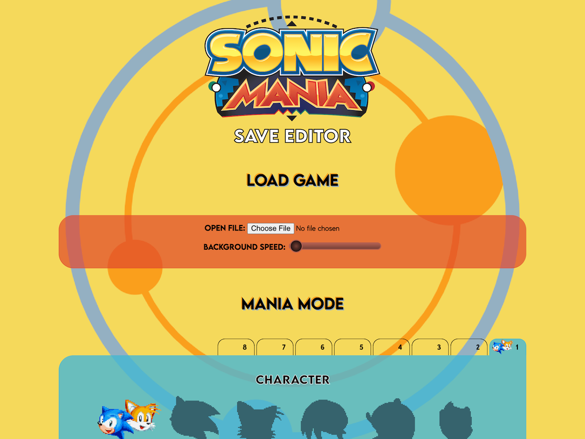
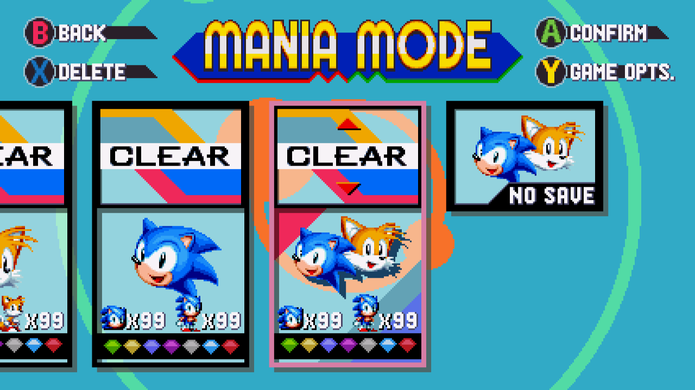

# sonic-mania-save-editor

A [save game editor for *Sonic Mania*](https://jcfieldsdev.github.io/sonic-mania-save-editor/). Written in JavaScript. *Sonic Mania* is a platform game released for Windows in 2017.

The [saves](https://github.com/jcfieldsdev/sonic-mania-save-editor/tree/master/saves) directory contains saves in different formats for testing purposes.

## Specifications

- [Save format](https://github.com/jcfieldsdev/sonic-mania-save-editor/blob/master/save%20format.md)

## Compatibility

### Overview

| | Release | Platform | Year |
| -- | -- | -- | -- |
| ✅ | *Sonic Mania* | Windows | 2017 |

### Retro Engine

On Windows, the save file is located at `C:\Program Files (x86)\Steam\userdata\[identifier]\584400\remote\SaveData.bin`. Save files contain 8 *Mania Mode* slots and 3 *Encore Mode* slots.

## Acknowledgments

[Sprite rips](https://www.spriters-resource.com/pc_computer/sonicmania/) taken from [The Spriters Resource](https://www.spriters-resource.com/).

[Vectorized Sonic Mania logo](https://www.deviantart.com/luisfelipe2408/art/Sonic-Mania-Logo-Vetor-EPS-707398569) by [luisfelipe2408](https://www.deviantart.com/luisfelipe2408).

Animated [giant ring](https://www.deviantart.com/winstontheechidna/art/Sonic-Mania-Giant-Ring-Animated-839495886) and [transparent giant ring](https://www.deviantart.com/winstontheechidna/art/Sonic-Mania-Transparent-Giant-Ring-Animated-839674405) graphics by [WinstonTheEchidna](https://www.deviantart.com/winstontheechidna).

Uses [Ray icon](https://www.deviantart.com/nibroc-rock/art/Vector-Icon-Ray-set3-587338025) by [Nibroc-Rock](https://www.deviantart.com/nibroc-rock).

Uses Evolve Sans font by MadeType and Lemon Milk font by Marsnev.

## Authors

- J.C. Fields <jcfields@jcfields.dev>

## License

- [MIT license](https://opensource.org/licenses/mit-license.php)

## See also

- [*Sonic CD* Save Editor](https://github.com/jcfieldsdev/sonic-cd-save-editor)—A save editor for the Sega CD game *Sonic CD*.
- [*Sonic 3* Save Editor](https://github.com/jcfieldsdev/sonic3-save-editor)—A save editor for the Genesis games *Sonic 3* and *Sonic 3 & Knuckles*.
- [*Knuckles Chaotix* Save Editor](https://github.com/jcfieldsdev/chaotix-save-editor)—A save editor for the 32X game *Knuckles Chaotix*.
- [*Tails Adventure* Password Generator](https://github.com/jcfieldsdev/tailsadv-password-generator)—A similar tool for the Game Gear game *Tails Adventure*.
